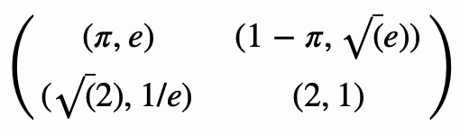
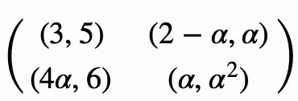

# Game-Theory-Midterm-Prep

Here are 50 questions to help prepare you for your Game Theory midterm. You can see the `solutions` in the `solutions.pdf` file. You can see the sources in the <a href="#resource">resources</a> section.  

1. Represent the following game in normal form:

> Alice, Bob and Celine are childhood friends that would like to communicate online. They have a choice between 3 social networks: facebook, twitter and G+.

Clearly state the players, strategy sets and interpretations of the utilities.

2. Represent the following game in normal form and then analyze it. 

> Assume two neighbouring countries have at their disposal very destructive armies. If both countries attack each other the countries’ civilian population will suffer 10 thousand casualties. If one country attacks whilst the other remains peaceful, the peaceful country will lose 15 thousand casualties but would also retaliate causing the offensive country 13 thousand casualties. If both countries remain peaceful then there are no casualties.

3. Attempt to predict rational behaviour using iterated elimination of dominated strategies for the following:

| 2, 1        | 1, 1           |
| ------------- |:-------------:|
| 1, 1     | 1, 3 |

4. Attempt to predict rational behaviour using iterated elimination of dominated strategies for the following:

| 2, 11       | 1, 9           | 3, 10 | 17, 22 |
| ------------- |:-------------:|:-----:|:-----:|
| 27, 0      | 3, 1           | 1, 1 | 1, 0 |
| 4, 2       | 6, 10           | 7, 12 | 18, 0 |

5. Attempt to predict rational behaviour using iterated elimination of dominated strategies for the following:

| 3, -3        |  -1, 1           |
| ------------- |:-------------:|
| 2, 1     | 7, -6 |

6. Attempt to predict rational behaviour using any method you know. 

| 3, 2       | 3, 1           | 2, 3 |
| ------------- |:-------------:|:-----:|
| 2, 2      | 1, 3           | 3, 2 |

7. Analyze the following game. 

| 7, 3        |  0, 2           |
| ------------- |:-------------:|
| 2, 1     | 6, 1 |
| 4, 0     | 4, 2 |

8. Compute the Nash equilibrium (if they exist) in pure strategies for the following game. 

| 5, 3       | 70, -1           | 4, 2 |
| ------------- |:-------------:|:-----:|
| 6, 7      | 71, 2          | 2, 1 |

9. Compute the Nash equilibrium (if they exist) in pure strategies for the following game. 

| 6, 7      |  2, 1           | 4, 6 |
| ------------- |:-------------:|:-----:|
| 0, 4      | 3, 8          | 2, 3 |
| 1, 2      | 1, 5          | 1, 1 |

10. Compute the Nash equilibrium (if they exist) in pure strategies for the following game. 

11. For what values of α does a Nash equilibrium exist in pure strategies for the following game

12. Attempt to predict rational behaviour using iterated elimination of dominated strategies for the following:

| 1, 1       |  1, 1           |
| ------------- |:-------------:|
| 0, 2     | 2, 0 |

13. Analyze the following game. 

| 3, 2        |  6, 5           |
| ------------- |:-------------:|
| 1, 4     | 2, 3 |

14. Define Strictly dominated strategy.

15. Analyze the following game. 

| 3, 2        |  0, 0           |
| ------------- |:-------------:|
| 1, 1     | 2, 3 |

16. Define Weakly dominated strategy.

17. Define Normal form game.

18. Analyze the following game. 

| -1, -1        |  -4, 0           |
| ------------- |:-------------:|
| 0, -4     | -3, -3 |

19. Analyze the following game. 

| 5, -1        |  11, 3           | 0, 0 |
| ------------- |:-------------:|:-------------:|
| 6, 4     | 0, 2 | 2, 0 |

20. Analyze the following game. 

| -1, -1        |  -4, 0           |
| ------------- |:-------------:|
| 0, -4     | -3, -3 |
| -2, -3     | -5, 1 |

21. Analyze the following game. 

| 1, 1        |  3, 1           |
| ------------- |:-------------:|
| 0, 2     | 2, 0 |

22. Analyze the following game. 

| 1, 1        |  2, 1           |
| ------------- |:-------------:|
| 0, 2     | 2, 0 |

23. Attempt to predict rational behaviour using iterated elimination of dominated strategies for the following:

| 4, 3       | 5, 1           | 6, 2 |
| ------------- |:-------------:|:-----:|
| 2, 1     | 3, 4           | 3, 6 |
| 3, 0       | 9, 6           | 2, 8 |

24. Suppose everyone in your town selects a real number between 0 and 100, inclusive (i.e. 0 and 100 are both possible choices, as is any other number between). The winner is the individual (or individuals) who selects the number closest to 2/3 of the average of numbers chosen. What number do you choose? Why?

25. Define Best Response.

26. Analyze the following game. 

| 3, 2        |  0, 0           |
| ------------- |:-------------:|
| 1, 1     | 2, 3 |

27. Compute the Nash equilibrium (if they exist) in pure strategies for the following game. 

| 5, 4      |  3, 3          | 5, 2 | 3, 2 |
| ------------- |:-------------:|:-----:|:-----:|
| 3, 2      | 9, 3          | 5, 2 | 7, 1|
| 4, 5      | 2, 1         | 5, 4 | 5, 6 |
| 2, 2 | 4, 0 | 5, 0 | 8, 1 |

28. Compute the Nash equilibrium (if they exist) in pure strategies for the following game. 

| 1, 1     |  2, 2           | 4, 1 |
| ------------- |:-------------:|:-----:|
| 2, 2      | 5, 5         | 3, 6 |
| 1, 4     | 6, 3          | 0, 0 |

29. Compute the Nash equilibrium (if they exist) in pure strategies for the following game. 

| 9, 9     |  2, 2         | 4, 1 |
| ------------- |:-------------:|:-----:|
| 2, 2      | 5, 5         | 3, 6 |
| 1, 4     | 6, 3          | 0, 0 |

30. Compute the Nash equilibrium (if they exist) in pure strategies for the following game. 

| 1, -1     |  -1, -1           | -1, 1 |
| ------------- |:-------------:|:-----:|
| -1, -1     | -1, 1         | 1, -1 |
| 0, 0     | 0, 0          | 0, 0 |

<h3 id="resource">Resources</h3>

*  my notes
* https://vknight.org/Year_3_game_theory_course/Homework/Homework_1/
* https://vknight.org/Year_3_game_theory_course/Homework/Homework_2/
* https://vknight.org/Year_3_game_theory_course/Exam/2013-2014.pdf
